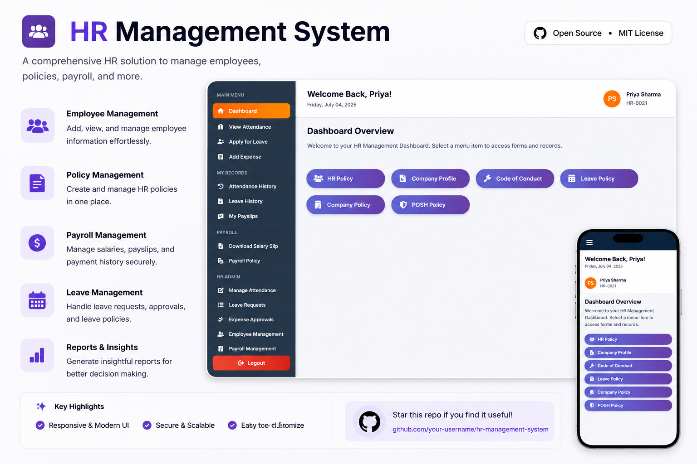
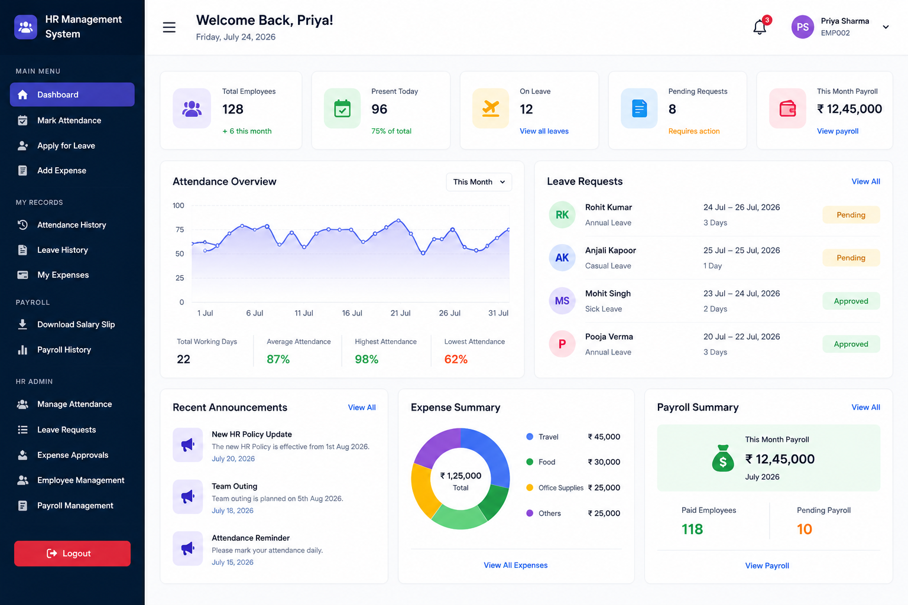

# 🚀 HR Management System

<p align="center">
  
</p>

<p align="center">


</p>

A modern, responsive, and lightweight **HR Management System** designed to simplify employee management, attendance tracking, leave requests, payroll records, expense management, and HR administration.

Built with a clean UI and optimized for both desktop and mobile devices.

---

# ✨ Features

## 👨‍💼 Employee Module
- Employee Dashboard
- Employee Profile
- Attendance Tracking
- Leave Application
- Expense Submission
- Salary Slip Download
- Payroll History

---

## 🏢 HR Admin Module

- Employee Management
- Attendance Management
- Leave Approval
- Expense Approval
- Payroll Management
- Company Policies
- HR Policies
- Code of Conduct
- POSH Policy
- Leave Policy

---

# 📸 Screenshots

## Dashboard

<p align="center">

</p>

---

# 📱 Responsive Design

✔ Desktop

✔ Tablet

✔ Mobile

Designed with a mobile-first approach for a smooth experience across all screen sizes.

---
## 🛠️ Tech Stack

| Technology | Description |
|------------|-------------|
| **Google Apps Script** | Backend, API, Authentication & Business Logic |
| **Google Sheets** | Database & Data Storage |
| **HTML5** | Structure |
| **CSS3** | Styling |
| **JavaScript (ES6)** | Client-side Functionality |
| **Bootstrap 5** | Responsive UI Components |
| **Font Awesome** | Icons |

---
# 🌐 Live Demo

Experience the HR Management System in action by visiting the live application.

<p align="center">

### 🚀 **Live Website**

**https://flowtixlab929.github.io/hrms/**

</p>
# 🔑 Demo Access

> Use the following demo credentials to explore the system.

## 👨‍💼 HR Administrator

| Field | Value |
|-------|-------|
| **Employee ID** | `EMP002` |
| **Password** | `12345` |

---

## 👤 Employee

| Field | Value |
|-------|-------|
| **Employee ID** | `EMP005` |
| **Password** | `123456` |

> **Note:** These are demo credentials intended for testing and evaluation purposes only.

---

## 🚀 Deployment

This project is built entirely using **Google Apps Script**, making it easy to deploy without managing a dedicated backend server.

### Features

- ✅ Cloud Hosted
- ✅ Secure Login Authentication
- ✅ Google Sheets Database
- ✅ Role-Based Access (HR & Employee)
- ✅ Responsive Design
- ✅ Mobile Friendly
- ✅ No Additional Server Required
- ✅ Easy Maintenance

---

## 💡 Why Google Apps Script?

- Seamless integration with Google Workspace
- Rapid development and deployment
- Secure cloud hosting
- Cost-effective for small and medium organizations
- Easy integration with Google Sheets, Drive, Gmail, and Calendar
# 🔐 User Roles

### Employee

- Dashboard
- Mark Attendance
- Apply Leave
- Submit Expenses
- Download Salary Slip
- View Payroll History

### HR Admin

- Manage Employees
- Manage Attendance
- Approve Leaves
- Approve Expenses
- Payroll Management
- Policy Management

---

# 📈 Future Improvements

- Email Notifications
- Face Attendance
- QR Attendance
- Multi Company Support
- Department Management
- Employee Performance Tracking
- Dark Mode
- REST API
- PostgreSQL Support
- Authentication with JWT

---

# 🌟 Why This Project?

- Clean UI
- Professional Design
- Responsive Layout
- Fast Performance
- Easy Deployment
- Lightweight
- Beginner Friendly
- Easily Customizable

---

# 🤝 Contributing

Contributions are welcome!

1. Fork the repository
2. Create your feature branch

```bash
git checkout -b feature/NewFeature
```

3. Commit changes

```bash
git commit -m "Added New Feature"
```

4. Push

```bash
git push origin feature/NewFeature
```

5. Open a Pull Request

---

# 📄 License

This project is licensed under the **MIT License**.

---

# 👨‍💻 Author

**Ingen**

If you like this project, don't forget to ⭐ the repository.

---

<p align="center">

### ⭐ Star this repository if you found it useful!

Made with ❤️ for modern HR Management.

</p>
